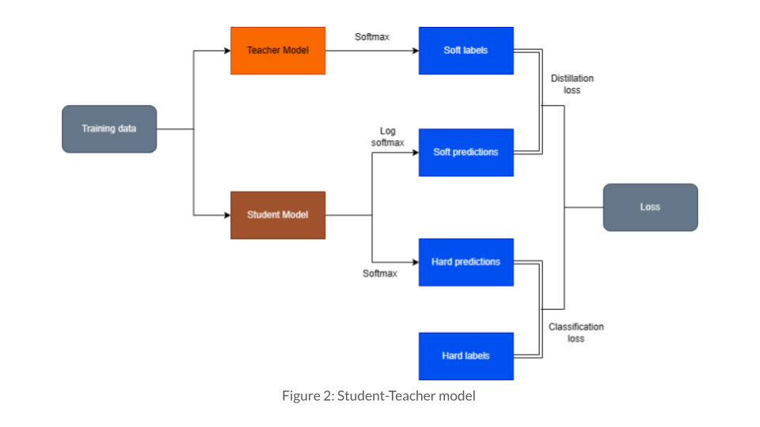
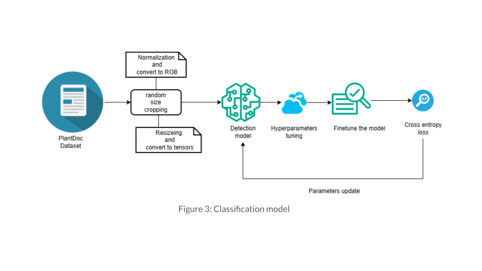
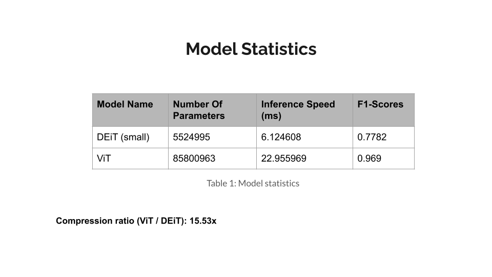
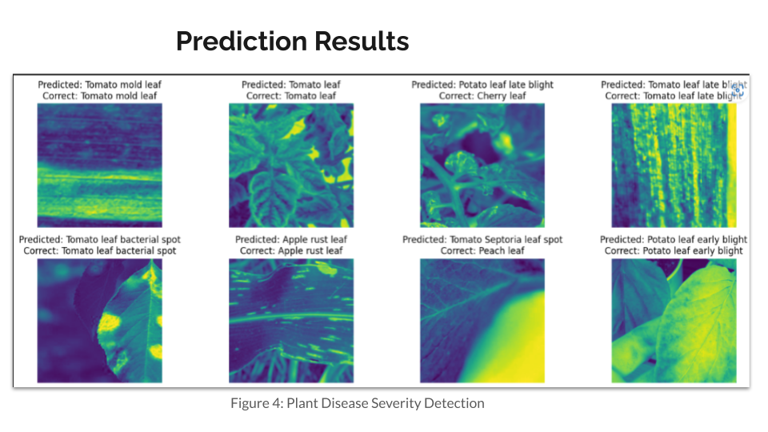
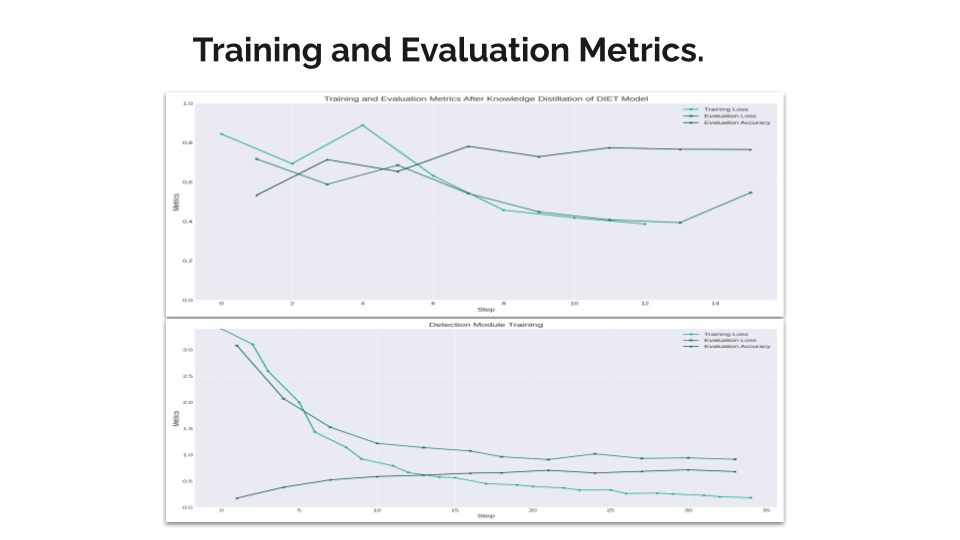
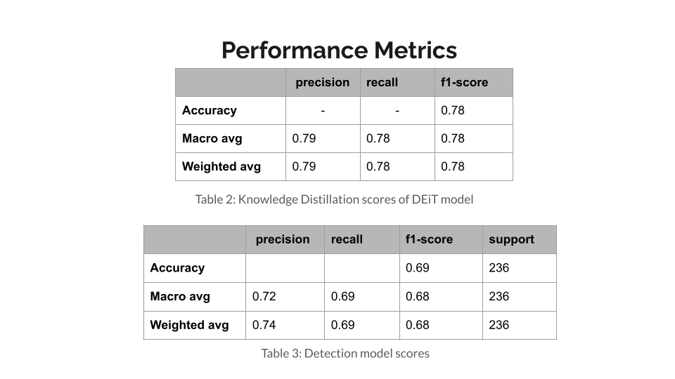

# Crop-Care

> This project develops an edge computing solution for real-time crop disease detection and classification within agricultural IoT systems. By processing data locally and using knowledge distillation, we aim to reduce latency, improve decision-making speed in remote areas, and ultimately promote sustainable and efficient farming practices.

### Installation

1. **Clone the repository:**
    
    ```bash
    git clone https://github.com/SamarthGarg09/Crop-Care.git
    cd Crop-Care
    ```
2. **Create the conda environment and install dependencies:**
    
     ```bash
    conda env create -f environment.yml
    conda activate crop-care
     ```

3. **Running the Notebooks**
    
    1. Knowledge Distillation:
        * Run `notebooks/student_training.ipynb` to train the student model using knowledge distillation.

    2. Disease Detection:
        * Run `notebooks/disease_severity_detection.ipynb` to train the student model for disease detection.
        * Important: Update the checkpoint path in the notebook to use the newly trained student model.

    3. Model Characteristics:
        * Use `notebooks/characterisitcs.ipynb` to analyze the model's parameters and inference speed.

## Model Framework and Architecture







## Results






## License

This project is licensed under the [MIT License](LICENSE)

## Contact

* Email: samarthgarg92001@gmail.com

## Contributors
* Ansh Rusia (2020IMT-012)
* Samarth Garg (2020IMT-085)
* Shubhajeet Pradhan (2020IMT-097)
* Varun Kumar Tiwari (2020IMT-112)